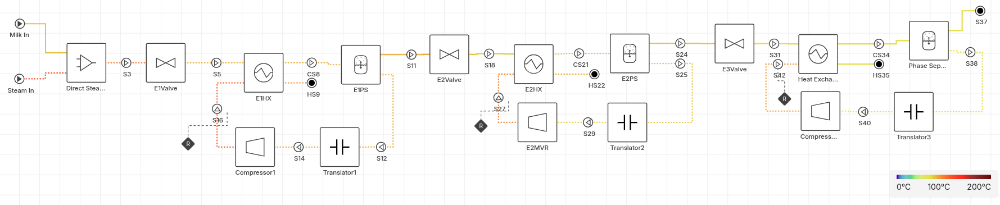

# Three-Effect Milk Evaporator with Mechanical Vapor Recompression



## Purpose and arrangement

The flowsheet represents a steady-state milk-concentration system comprising three serial evaporation effects. Milk liquor is preheated by direct steam injection, passed through three progressively lower-pressure flash/evaporation stages, and separated into concentrated liquid and water-rich vapor after each stage. Rather than using one effect's vapor to heat the next effect, this model applies **mechanical vapor recompression (MVR) to each individual effect**: vapor from each separator is compressed and recycled to the hot side of that same effect's heat exchanger. Thus, the three effects are connected in series by the milk liquor, but their heating-vapor circuits are separate recycles.

The flowsheet contains two thermodynamic domains:

| Domain | Components and phases | Used by |
| --- | --- | --- |
| Milk liquor | `milk_solid` and `water`; liquid and vapor phases | Milk feed, direct-steam-injection outlet, valves, cold sides of exchangers, and phase separators |
| Heating vapor | Pure `water`; liquid and vapor phases | Steam feed, exchanger hot sides, MVR compressors |

## Feed and initial heating

The feed enters `Direct Steam Injection1` as 4.0 mol/s milk at 80 degC and 100 kPa, with mole fractions 0.994 water and 0.006 milk solids. A 0.853 mol/s pure-water steam stream at 120.26 degC and 200 kPa enters the second inlet of the direct-steam-injection block. The resulting mixed milk stream is the inlet to the first pressure-reduction valve.

Direct steam injection is represented as a material and energy mixing operation. The injected steam becomes part of the milk-side material balance; it is not an external exchanger utility. Consequently, both the water added by steam and the feed water must be included when reproducing the concentration and overall mass balances.

## Liquor train

The milk-side process path is:

```text
Milk feed + steam
  -> Direct Steam Injection1
  -> E1Valve -> E1HX (cold side) -> E1PS
  -> E2Valve -> E2HX (cold side) -> E2PS
  -> E3Valve -> Heat Exchanger3 (cold side) -> Phase Separator3
```

`E1Valve`, `E2Valve`, and `E3Valve` establish the effect pressures by isenthalpic pressure reduction. Their specified pressure drops are 40, 20, and 10 kPa, respectively. The first valve therefore reduces the initially 100 kPa milk stream to 60 kPa. The heat exchangers subsequently add heat to the reduced-pressure liquor; their cold-side outlet is allowed to be two-phase. Each downstream phase separator removes the generated vapor from this heated liquor.

The liquid-dominant outlet (`outlet_1`) of `E1PS` feeds `E2Valve`; `E2PS.outlet_1` feeds `E3Valve`; and `Phase Separator3.outlet_1` is the final concentrated-milk product. The final product is drawn in the supplied model but has no downstream unit operation.

## Effect structure

All three effects use the same functional pattern. A cold-side milk stream receives heat from recompressed water vapor, then a phase separator splits the exchanger outlet into a liquid-dominant continuation stream and a vapor-dominant recycle stream.

| Effect | Milk heating exchanger | Separator | Liquid continuation | Vapor recycle |
| --- | --- | --- | --- | --- |
| 1 | `E1HX` | `E1PS` | `E1PS.outlet_1` to `E2Valve` | `E1PS.outlet_2` to `Translator1` |
| 2 | `E2HX` | `E2PS` | `E2PS.outlet_1` to `E3Valve` | `E2PS.outlet_2` to `Translator2` |
| 3 | `Heat Exchanger3` | `Phase Separator3` | `Phase Separator3.outlet_1` is product | `Phase Separator3.outlet_2` to `Translator3` |

Each separator sends 99% of the liquid phase and 1% of the vapor phase to the liquid-continuation outlet. The other outlet is therefore vapor-dominant, with 1% liquid entrainment. Vaporization occurs in the heated, reduced-pressure liquor before separation.

## Mechanical-vapor-recompression circuits

The vapor-dominant stream from each separator is recompressed and returned to the hot side of its corresponding heat exchanger:

```text
E1PS.outlet_2 -> Translator1 -> Compressor1 -> E1HX hot side
E2PS.outlet_2 -> Translator2 -> E2MVR      -> E2HX hot side
Phase Separator3.outlet_2 -> Translator3 -> Compressor3 -> Heat Exchanger3 hot side
```

All compressors have an isentropic efficiency of 0.90. Their specified outlet pressures are:

| Compressor | Outlet pressure |
| --- | ---: |
| `Compressor1` | 80 kPa |
| `E2MVR` | 56 kPa |
| `Compressor3` | 72 kPa |

The hot-side outlet of each exchanger is a condensate stream with no downstream connection in this flowsheet.

## Heat-exchanger representation

Each exchanger transfers heat from the recompressed vapor to the milk liquor. The specified pressure drop is zero on both sides.

| Exchanger | Overall heat-transfer coefficient, U | Area, A | UA |
| --- | ---: | ---: | ---: |
| `E1HX` | 1000 W/(m2 K) | 10 m2 | 10,000 W/K |
| `E2HX` | 1000 W/(m2 K) | 1 m2 | 1,000 W/K |
| `Heat Exchanger3` | 70 W/(m2 K) | 1 m2 | 70 W/K |

The heat-transfer area and overall heat-transfer coefficient determine the duty in each effect. This couples vapor recycle, compressor discharge conditions, milk vaporization, and separator vapor flow within each MVR loop.

## Connectivity reference

The following connection list captures the process structure independently of drawing layout. It is sufficient to reproduce the network in a process simulator that provides equivalent unit models.

| From | To | Service |
| --- | --- | --- |
| Milk feed | `Direct Steam Injection1.inlet` | Milk feed |
| Steam feed | `Direct Steam Injection1.steam_inlet` | Direct heating steam |
| `Direct Steam Injection1.outlet` | `E1Valve.inlet` | Mixed milk liquor |
| `E1Valve.outlet` | `E1HX.cold_side_inlet` | Effect 1 liquor |
| `Compressor1.outlet` | `E1HX.hot_side_inlet` | Effect 1 recompressed vapor |
| `E1HX.cold_side_outlet` | `E1PS.inlet` | Heated/partially vaporized liquor |
| `E1PS.outlet_1` | `E2Valve.inlet` | Effect 1 liquid |
| `E1PS.outlet_2` | `Translator1.inlet` | Effect 1 vapor-rich stream |
| `Translator1.outlet` | `Compressor1.inlet` | Effect 1 pure-water vapor |
| `E2Valve.outlet` | `E2HX.cold_side_inlet` | Effect 2 liquor |
| `E2MVR.outlet` | `E2HX.hot_side_inlet` | Effect 2 recompressed vapor |
| `E2HX.cold_side_outlet` | `E2PS.inlet` | Heated/partially vaporized liquor |
| `E2PS.outlet_1` | `E3Valve.inlet` | Effect 2 liquid |
| `E2PS.outlet_2` | `Translator2.inlet` | Effect 2 vapor-rich stream |
| `Translator2.outlet` | `E2MVR.inlet` | Effect 2 pure-water vapor |
| `E3Valve.outlet` | `Heat Exchanger3.cold_side_inlet` | Effect 3 liquor |
| `Compressor3.outlet` | `Heat Exchanger3.hot_side_inlet` | Effect 3 recompressed vapor |
| `Heat Exchanger3.cold_side_outlet` | `Phase Separator3.inlet` | Heated/partially vaporized liquor |
| `Phase Separator3.outlet_2` | `Translator3.inlet` | Effect 3 vapor-rich stream |
| `Translator3.outlet` | `Compressor3.inlet` | Effect 3 pure-water vapor |

The unconnected streams are the three exchanger hot-side outlets (condensates) and `Phase Separator3.outlet_1` (concentrated milk product). A complete plant model may route condensates to recovery or disposal and route the product to cooling, storage, or a further concentration step; these operations are outside the supplied flowsheet boundary.

## Modelling scope

The model is steady state. It resolves material balances, phase equilibrium, heat transfer, and MVR power demand. It does not include explicit vessels, holdup, pumps, piping losses beyond the three liquor valves, condensate handling, noncondensable-gas removal, fouling, or product-quality constraints.
