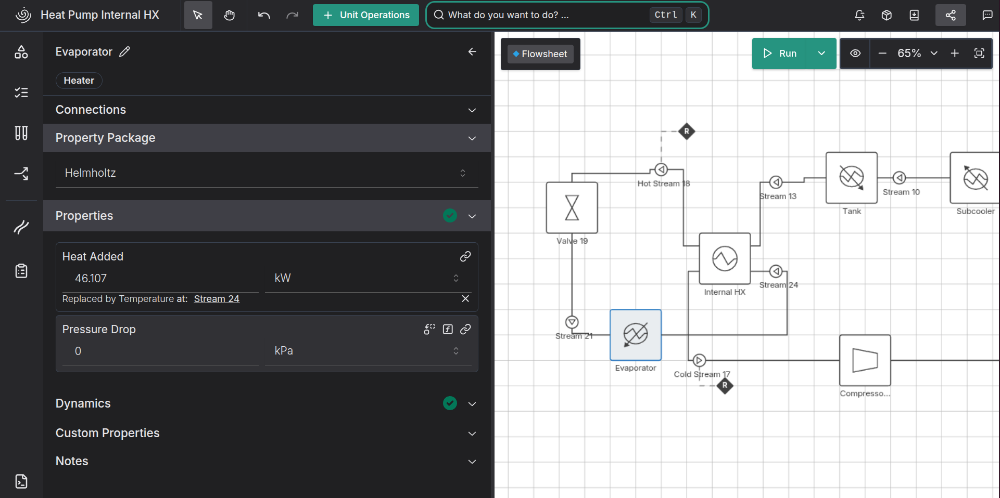

\newpage

# Abstract

Chemical process models and Chemical Digital Twins frequently rely on equation-oriented models to encode the behaviour of a factory. As equation oriented models grow in complexity, reasoning about their structure becomes harder. 
This paper proposes an alternative workflow to build equation oriented models, inspired by traditional control systems. 
A set of properties for each unit operation is chosen as the set required to fully specify the state. 
These can then be replaced by other variables as required for a specific case. 
This approach is demonstrated in the  equation-oriented modelling tool Pyomo. 
Benefits in model interpretability, maintentance, initialisation, and scaling methods are discussed. Various case studies demonstrate how processes can be modelled in this manner, and how these techniques may prove advantageous in a graphical user interface for chemical process design. 
These methods may be adopted by the modelling community to make it easier to build and maintain large equation oriented models.

\newpage

# Introduction

Designing and operating chemical factories requires accurate, comprehensive models of their behaviour. A powerful tool to represent chemical processes is equation-oriented algebraic modelling, as chemical processes often closely follow first-principles behaviour and include non-linear dynamics, two things that equation oriented modelling excels at [@shacham1982equation]. 

At its simplest, equation-oriented modelling involves specifying equations to represent the system, and solving those equations to find the unknown properties. However, modern processes are very complex, and Digital Twin technology means these models are built to be more integrated than ever before. This results in very complex equation oriented models and very large sets of equations.

Because equation-oriented modelling is inherently implicit, in these large models it can be hard to interpret the interactions between variables, or understand what is required to fully define the model. Additionally, equation oriented modelling still fundamentally relies on numerical methods to solve the system of equations. Initial values and scaling factors for variables can be the difference between a model succeeding or failing to converge on a solution. This becomes more of a problem as the mathematical model grows larger. 

To help deal with the complexity of modern equation-oriented models, software engineering techniques can be applied. Equation oriented models are usually specified in a declarative manner through algebraic modelling languages. Newer algebraic modelling languages such as Pyomo draw on software engineering principles of abstraction and ecapsulation to make this process easier. They also include tools to help with initialisation and scaling. However, as an equation oriented model is considered simeultaneously, while a conventional software program is run iteratively, it is much harder to apply these techniques and new methods need to be developed to simplify how a model is built.

This article introduces a new method to fully define an equation-oriented model. We propose that this method will simplify the process of squaring, initialising, and scaling a model. Our library, pyomo-replace, demonstrates some advantages of this approach in the Pyomo and IDAES [@miller2018next] ecosystem, and the Ahuora Platform provides a case study of this approach in a graphical application.

## Background

### Chemical Process Modelling

In the Chemical Process industry, modelling and simulation is frequently used to design factories, and ensure that they run smoothly. Factories use many different compounds and fluids, with many different pieces of equipment, known as *unit operations*, to heat, cool, mix, and separate the fluid streams. Some properties, such as temperature, pressure, power, or flow, can often relatively easily measured. Other properties, such as efficiency, heat capacity, or composition, may be harder to measure. Process modelling can help to predict these properties, to accurately size equipment or help set optimal operating conditions. 

With the advent of more computing resources and networked sites, process modelling has become more critical than ever before.  One way this is shown is in the rise in popularity of Digital Twins, which try to make a complete and comprehensive model of many different properties of entire sites and their surroundings [@walmsley2024adaptive]. As these models have become larger, being able to understand all of the constraints within the system simultaneously becomes harder and harder, making it harder to run, interpret, or adjust the model. 

The behaviour of Chemical processes is commonly modelled with Equation Oriented models [@biegler1997systematic]. This is usually done in an Algebraic Modelling Language or equation-oriented modelling framework, sometimes with the assistance of graphical user interface (GUI). 

### Equation Oriented Modelling

Fundamentally, an Equation-Oriented Model is simply a set of mathematical equations, optionally with an objective function [@biegler2010nonlinear].

The main parts of these equations are:

- *Constants:* Fixed numbers that do not change.
- *Variables:* unknown values we solve the set of equations to find.
- *Constraints:* equality or inequality equations that are used to implicitly define the value, or solution space of, the variables. 
- An *Objective Function*: a function that is defined in terms of the variables, returns a value to minimise or maximise within the space of valid solutions. In square models an objective function is not required.

### Equation Oriented Modelling Frameworks 

Constants, Variables, Constraints, and objectives are fundamentally all that is required in a mathematical model. However, over time additional abstractions have been developed for easier programmatic creation and manipulation of models, borrowing from conventional software development data structures. 

Traditionally, equation oriented models were built in special-purpose languages, such as GAMS and AMPL. More recently they have moved to general-purpose programming languages, which have extra tooling avaliable that allow you to build and initialise large equation-oriented models programmatically [@jusevivcius2021experimental]. 
Some of the main modern equation oriented modelling tools include JuMP, built on Julia, and Pyomo, built on python. 

We will focus on Pyomo in particular here, as it was built with chemical process modelling in mind and has good libraries to aid in chemical process modelling [@hart2011pyomo]. It is a framework for building mathematical models that is written in Python . It includes tools to manage abstraction and complexity in a mathematical model, and to define initialisation routines and scaling factors to enhance numerical stability. 
The equation oriented modelling framework Pyomo includes the following abstractions:

- Constants and Variables are represented as *Fixed Variables* and *Unfixed Variables* respectively. It is easy to change which variables are fixed and which are unfixed, so a model with the same structure can be used to solve for different variables. I.e either you can fix $x$ to calculate $y$, or you can fix $y$ to calculate $x$.
- Variables and Constraints can be indexed across a set. A variable or constraint is added for each item in the set. Sets are constant - you can't add or remove items during solving - but they provide a generalisation that makes it easy to scale up, down, or modify problems for slightly different cases.  
- Variables can be grouped into *Blocks*. Blocks can also have sub-blocks inside them, making a tree data structure^[Variables and Blocks can be thought of like Files and Folders in a filesystem. Blocks only provide structure but no information, and can be nested inside each other, while variables contain the actual values in the model]. 

Blocks are of particular interest here. Similar to how a class in object-oriented programming provides encapsulation of more complex functionality, Blocks are used to isolate the complex internal models of different parts of a system. For example, in a mathematical model of a chemical factory, a block may be used to model each individual unit operation (a pump, heater, tank, etc). The model inside the unit operation is isolated from the higher level model, which only cares about the properties of the fluid flowing in and out of the unit operation block. 

Pyomo also includes some even higher level modelling extensions, which are of particular relevance to Chemical Process Modelling:

- *Pyomo.DAE* allows defining Differential Algebraic Equations across "infinite" sets that are discretised, automatically creating the necessary constraints to define derivatives and integrals [@nicholson2018pyomo]. This is naturally useful in chemical and process modelling to create 1D simulations across time, taking in to account holdup, tank level, and so forth. 
- *Pyomo.network* allows you to represent your model as a graph: Blocks become nodes in the graph, and they can be connected to other nodes via edges called "arcs" that define equality constraints between variables [@bynum2021pyomo]. In many domains the graph view better represents the model structure. It also allows propogating initial values throughout a model. This is of particular importance as it allows sharing of information between distinct blocks. In a Chemical Process, it is natural to use this interface to encode the connections between different unit operations, so that the output material of one unit operation is the input material to a successive unit operation.

Pyomo's construction techniques make it possible to create libraries of pre-written blocks, containing all the constraints and variables to model a piece of a physical system [@dowling2015framework]. One such library is IDAES-PSE. Built on top of Pyomo, it creates blocks to represent chemical unit operations such as compressors, heaters, tanks, and many more [@miller2018next]. It uses pyomo.DAE to represent time as a continuous differentiable property, and Pyomo.network to represent the connections between unit operations. Because the constraints are abstracted, the user doesn't have to think too much about the mathematical modelling - instead it is a chemical simulation platform.

### Squaring a model

In order to solve a set of equations exactly, a "square" model is required. This term is taken from linear algebra where a matrix must be square to be invertible, i.e have an exact solution. What it really means is that there must be the same number of equations (constraints) as there are unknowns (unfixed variables). 

The difference between the two is described as the degrees of freedom. A model that has more unknowns than constraints is said to have $n$ degrees of freedom, where $n_{\text{degrees\ of\ freedom}}$ is given by

$$
n_{\text{degrees\ of\ freedom}} =  n_{\text{variables}} - n_{\text{constraints}}
$$

Additionally, all the variables and equations must be linerarly independent. When building an equation oriented model, the user will invariably come across the problem of Degrees of Freedom; usually they will not have specified the model sufficiently to be able to solve for an exact solution, i.e $n_{\text{degrees\ of\ freedom}} > 0$. 

IDAES has methods to calculate the number of degrees of freedom, and if there are any over-defined or under-defined sets that make the model linearly dependent [@lee2024model]. Still, figuring out how many and which variables need to be "fixed" to make the model square can be a challenge. It becomes easier if the documentation of a block has defined exactly how many degrees of freedom it has, and which variables it expects to have fixed. 

### Initialisation <!--& Scaling-->

In practice, Algebraic modelling problems are solved by initialising the unknown variables to a "best guess", and then performing an iterative search that gradually converges on the solution. In practice, this process does not always work, particularly when you are modelling non-convex systems and you start in the wrong region of convexity, or outside of the region your model was designed for [@casella2008beyond]. Even if the algorithm is able to converge, it may take significantly longer than if you had started with a good initial guess. 

To help with this process, IDAES includes methods to initialise a model before solving. This involves solving part of a model, or using a simpler model to estimate what the true solution might be. However, these methods are often built around the assumption that you have fixed certain variables - if you are instead solving for those variables, the initialisation method is unlikely to work as well. 

<!--Scaling works in a similar manner. In order for mathematical solvers to find accurate solutions, variables need to be scaled so that they are all approximately the same magnitude. The amount that these variables need to be scaled by is called the *scaling factor*, and it is usually some order of magnitude. IDAES includes methods to calculate the scaling factors of all variables, once you have provided the scaling factor of a few key variables. -->

## Related Work

The field of static structural analysis has helped to solve some of the problems of squaring a model. In [@bunus2001debugging], a method is proposed to help debug when a model is singular, by using Dulmage-Mendelson Decomposition to identify sets of constraints that are over-constrained or under-constrained. These methods are commonly used in frameworks such as IDAES to help ensure a square model is valid [@lee2024model]. However, while these techniques are applicable to an entire "flat" system of equations, it is hard to apply them to an individual block without understanding of what external constraints are applied. Some preliminary work has been conducted to show that in some cases issues can be identified in this level [@nilsson2008type], but it is limited in its ability to detect errors and does not appear to have much uptake in systems such as Pyomo.

As initialisation is a common problem across equation-oriented modelling tools, a number of approaches have been considered to help overcome the numeric issues that arise during solving. Simple strategies include initialising at random points, initialising at zero, initialising at a previously solved location, or solving a simpler model first [@lawrynczuk2022initialisation]. IDAES models generally take the latter approach, initialising parts of the model at a time, removing some of the more complex constraints or solving a relaxed problem first. Pyomo Network includes methods to run sequential decomposition, which initialises every block in order once any blocks it depends on have been initialised [@pyomo_network_doc].


<!-- I'm removing scaling as a topic for now. However if we bring it back, Doug's paper "Jacobian-based Model Diagnostics and Application to Equation Oriented Modeling of a Carbon Capture System" needs to be cited here
Scaling is mostly a concern when variables have wildly different orders of magnitude. For example, when power is measured in order of $10^9$ $J$ but valve cross sectional areas are measured in the order of $10^{-2}$ $m^2$, the difference can quickly approach the precision of a floating-point number [@casella2017importance]. To remedy this, variables need to be scaled to similar orders of magnitude. Pyomo provides preprocessing tools for this. Often many variables require similar scaling factors based on the model definition, and so libraries such as IDAES provide tools to automatically propogate scaling factors across variables, after a few initial scaling factors are added [@idaes_scaling_doc]. However, the scaling factors the modeller needs to provide depend on the implementation of the model, and may be different to the variables that are fixed or the guesses that are required for initialisation.
-->

Taking a step back to look at the larger picture, Luyben et. al [@luyben1996design] observed and discussed the correlation between degrees of freedom in design-time models and in control models, especially for reactors and distillation columns. This is because the things you specify in design time, such as inlet flow rates or outlet temperatures, need to be controlled in the real factory, usually by valves. They argue that calculating the number of controlled parameters in a plant is an easier way to understand the degrees of freedom of a process than by trying to analyse the number of equations and variables in a model that can be adjusted independently. This is an interesting link between design and control specification that we will explore further in this paper.


# A new method to define models: Variable Replacement

## Intuition

In mathematical modelling, you can choose what variables in a model you want to specify, and which ones are calculated. In the physical world, you don't get to choose at all: there are some things that you can adjust, and some that simply follow as a natural consequence. The closest thing to "fixing" a property, or holding a property constant, is control theory. Let us consider a very simple model of a car's velocity:

$$
v = kx
$$

That is, the velocity $v$ of a car on flat ground is equal to some performance constant $k$ multiplied by the amount the accellerator pedal is depressed, $x$. If the accellerator is depressed further, the velocity of the car will increase. This can easily be modelled in an Algebraic Modelling language, with either the velocity of the accelleration fixed to fully define the system. In the physical world, the velocity of the car cannot be set; the only thing that can really be set is the position of the accellerator pedal. However, control theory allows you to instead hold $v$ constant, calculating the appropriate value of $x$ for that to be the case. 

The intuition behind variable replacement is similar. There are some variables that it is easy to think of as fully defining the system; we will call them "state variables". They are all linearly independent. All other variables can be defined in terms of these state variables^[This is analogus to the concept of a *critical set* in combinatorial design theory.]. In this example, the position of the accellerator pedal makes the most intuitive sense as the state variable, that is what you set to control the car's speed.

It follows by definition that if all state variables are fixed in a model, then the model will be fully defined, and have zero degrees of freedom. Fixing any other variable would cause the system to be over-defined. Thus, similar to in control theory, if you wanted to hold the velocity constant, you need to be able to adjust the amount the accellerator pedal is depressed. This is the fundamental principle behind variable replacement: start with all your state variables defined, and then if you want to set something else, you must choose a state variable to "replace", or unfix.

Starting with all the state variables fixed means you never have a under-defined model. Unfixing a state variable every time you fix something else means you never over-define your model. This makes it much clearer how your model is intended to be used. Initialisation and scaling methods also become much simpler if guesses are provided for all the state variables, as you only need to define one way to initialise/scale your model. 

## Formal Definition of Variable Replacement Methodology

This section outlines how Variable Replacement is defined on an equation oriented model, borrowing terminology and concepts from the Pyomo Equation-oriented Modelling ecosystem.

### Model

An equation oriented model can be specified as a set of Blocks, with each block containing variables and constraints between variables. In this context, a Block does not include constraints that reference anything outside that block. However, a Block may contain Ports, which provide a method of connecting Blocks together.

A Port is simply a collection of variables on a block. A port is specified to be either an Inlet Port or an Outlet Port. An Inlet port may be connected to an Outlet port containing an equivalent collection of variables. The inlet and outlet port do not need to be on the same block. Connecting two ports creates an equality constraint between the variable on the Outlet and the variable on the Inlet, that is, the variable on the inlet is defined to be equal to the corresponding variable on the outlet port. 

In chemical engineering, an Equation Oriented Model typically represents a flowsheet, a Block typically represents a unit operation, and Inlet and Outlet Ports represent inlets and outlets of a unit operation. 

### State Variables

Because each block contains a set of variables and constraints, it can be considered an independent system of equations and solved independently if the appropriate number of variables are fixed to make the problem square. Variable replacement requires defining a set of "*State Variables*", which, when all fixed, fully define the model. 

The state variables are chosen by first fixing all inlet variables. All inlet variables are automatically considered state variables, if and only if the inlet is not connected to an outlet. Then, additional variables are fixed in the model until the model is square. These variables are also considered state variables.

The set of state variables for a block is defined by the block itself, and the set of state variables cannot change. They may be unfixed, but only following certain rules as discussed subsequently. Typically, the set of state variables would be defined by the author of the block. As Blocks are an abstraction designed to be reused, this could be the developer of a library of modelling components, rather than the modeller of a specific flowsheet.

### Building a model

A model is then built out of a series of blocks. By default, all state variables are fixed, and all unconnected inlets are fixed, and so there will be no degrees of freedom. This fully specifies the model, as all operations are fully defined: either explicitly, or based on the outlet conditions of other operations.

### Replacing Variables.

Once a model is built, different variables can be fixed instead of the state variables. For this to happen, a couple of conditions need to be met:

- A variable must be chosen (that is not already fixed) and fixed. As the model was previously fully defined, this will make the model over-defined, with -1 degrees of freedom.
- To prevent the model becoming over-defined, a state variable must be chosen and unfixed. We say this state variable has been "replaced" with the new variable.
- The state variable must be chosen such that all equations in the model are still linearly independent. This can be done by choosing a state variable that is part of the Dulmage-Mendelson Overconstrained set when the new variable was fixed and the model was at -1 degrees of freedom. 

Metadata about which variables are replacing which state variables should be stored. If a variable is ever unfixed, the coresponding state variable must be fixed again. 

As long as these conditions are met, the model will stay at zero degrees of freedom and remain structurally valid. These rules are the essence of the variable replacement methodology.

### Advanced Cases

#### Indexed Variables

We have previously discussed how pyomo allows indexing variables by a constant set of indexes. This provides a convienient grouping of variables.

One Indexed Variable may be replaced by another Indexed Variable so long as the size of the indexed variables (the number of items in it's index set) are the same, and the model is still structurally sound afterwards; i.e there are no over or underconstrained variable sets. This is a convientent abstraction as it avoids having to replace each individual variable in a set. For example, in a tank, you could specify level over time instead of flow rate out of the tank over time. As long as they are both indexed by time, it is fine.

#### Tear Guesses in Network Loops

When an outlet is connected to an inlet that is upstream of the current Block, a cycle in the network graph is detected. Pyomo.network automatically handles detecting network loops, and requires that tear guesses must be specified to help the model initialise and solve. No special handling needs to take place for variable replacement to work with this. 

#### Calculating Inlet Properties

Inlets that are not connected to anything upstream are considered to be state variables. They can be replaced by other variables. This is generally fine, but some models are built with the expectation that inlet conditions are calculated. For example, the pressure exchanger model at [@watertap_pressure_exchanger] expects that the inlet flow on both sides is the same, meaning the flow of only one side needs to be fixed: the other side will be calculated to match. This type of model simply cannot work under the constraints we have applied on the system. 

However, there is a simple workaround to make these models possible. In this example, the flow balance constraint can be replaced with a variable that calculates the residual between the flows. This residual can be fixed to zero if one of the inlet flows is unfixed as a state variable. It is up the the model developer to decide which constraint should instead be expressed as a residual, and to explain to the users of the model that the residual should be fixed. However, specifying the model this way has some advantages, as it will explicitly show the reasons the inlet conditions do not need to be fixed. 

### Application to Optimisation Problems

Optimisation problems do not have zero degrees of freedom, and so this technique is not exactly applicable. However, generally a flowsheet is solved exactly, without performing optimisation, to provide a starting point for the optimisation algorithm. Then variables are unfixed and the optimisation problem is solved. This approach would work fine using the variable replacement methodology: variable replacement could be used to fully define the model for an initial solve. Then a set of additional variables can be unfixed and the optimisation algorithm can be run. 

Additionally, knowing the list of state variables may still provide good context for optimisation, as any state variables you unfix are the ones that you are calculating an optimum value for.

## A reference implementation: pyomo-replace

To aid in evaluating the advantages of a variable replacement approach to equation-oriented modelling, we have created a small python package built on IDAES and pyomo, called pyomo-repace. It demonstrates the principles of variable replacement in a format as similar as possible to standard IDAES modelling, to make it easier to draw comparisons between the two approaches. 

Pyomo-replace contains methods to keep track of the state variables in an IDAES model, and what variables are replacing them. The list of state variables and replacements can be easily printed to the screen to help explain the model structure. 

### An example in IDAES.

To show how pyomo-replace demonstrates the replacement logic, we will consider a simple example of a heater, where the inlet properties are specified and the outlet temperature is specified, and the heat duty is calculated from the outlet temperature.

First we must define the basic structure:

```
> m = pyo.ConcreteModel()
> m.fs = FlowsheetBlock(dynamic=False)
> m.fs.pp = iapws95.Iapws95ParameterBlock()
> m.fs.compressor = SVCompressor(property_package=m.fs.pp)
```
These lines:

- Create a new Equation Oriented Model in the Pyomo Framework
- Add a IDAES Flowsheet into the equation oriented model (This always required when building models with IDAES)
- Specify the fluid property package to model water, using the IAPWS95 specification [@wagner2002iapws]
- Add a Compressor unit operation to the flowsheet, using the IAPWS95 property package to model the properties of the water.

The `SVCompressor` unit model is an extension of the IDAES `Compressor` unit model that defines the state variables that should be used by `pyomo-replace`.

For simplicity we will focus on only one unit operation, because it is sufficient to show all the functionality of pyomo-replace. The methods are the same for flowsheets with more unit models. Once the unit models have been added to the flowsheet and connected up, pyomo-replace requires that all inlet ports are registered as state variables:

```
> register_inlet_ports(m.fs)
```

This registers the properties of all inlet ports that do not have another model upstream as state vars. This is done after the unit models have been fully defined and any connections between unit operations have been made. Once this method is called, the model should have zero degrees of freedom.

Now we can view all the state variables:

```
> pprint_replacements(m.fs)
```

This prints a list of all state variables, and any that are being replaced by other variables. As we have not yet replaced any state variables, it would simply print a list of all the variables that we need to either set a value for, or replace:

```
Unreplaced state variables:
 fs.compressor.work_mechanical
 fs.compressor.efficiency_isentropic
 fs.compressor.inlet.flow_mol
 fs.compressor.inlet.enth_mol
 fs.compressor.inlet.pressure
```

However, we wanted to specify the outlet pressure instead of the compressor Replacing a variable is as simple as calling a function, passing the new variable to fix and the state variable to unfix:

```
> replace_state_var(m.fs.compressor.ratioP, m.fs.heater.outlet.pressure)
```

Now we can run `pprint_replacements` again, to show that `work_mechanical` has been replaced by `outlet.pressure`. 

```
> pprint_replacements(m.fs)

Replaced state variables:
  (Fixed Variable) -> (Replaced State Variable)
  fs.h1.outlet.pressure -> fs.compressor.work_mechanical

Unreplaced state variables in block fs:
  fs.compressor.efficiency_isentropic
  fs.compressor.inlet.flow_mol
  fs.compressor.inlet.enth_mol
  fs.compressor.inlet.pressure
```

You can then set a value for `outlet.pressure` and all the other state variables, and provide a guess for `ratioP`. This model can then be initialized and solved using the standard pyomo and idaes libraries.

To those familiar with IDAES, this may appear to be a more complicated approach to fixing an outlet variable, as typically you would fix it directly rather than worrying about which state variable you are replacing. 


# Properties of a Variable Replacement approach to Equation Oriented Modelling

This method of replacing state variables to define a model does not fundamentally change the model itself. However, specifying a model in this way provides some guarantees and useful properties that traditional equation oriented methods lack.

A useful analogy may be in the study of programming language theory. Functional and Imperative programming languages are both turing complete, but certain problems are better represented in an imperative language, while other problems are more simply expressed in a functional manner. Likewise, static typing systems do not change the correctness of a program, but they do make it simpler to validate and reason about the program.

Variable replacement enforces a degree of regularity in the blocks that make up models, and in the overall structure. It provides a different paradigm in which to reason about equation oriented systems.

1. It fundamentally removes the problem of Degrees of Freedom when defining a model.
2. It standardises initialisation routines, as long as guesses are provided for state variables. <!--, and provides a standardised basis for calculating scaling factors. -->
3. The coupling of variables adds a level of interperetability to the model, which makes it easier to maintain and manipulate models.


## Removing the problem of Squaring a Model

To have a square model, you must have the same number of unknowns, or unfixed variables, as equations, i.e $n_{\text{degrees\ of\ freedom}} = 0$.

Traditional model libraries such as IDAES provide the equations, and then all that is required is to specify enough variables that the number of variables equals the number of unknowns. This can be done by repeatedly fixing variables in a part of a model that is not already over-defined^[i.e You must fix variables that are part of a Dulmage-Mendelson underconstrained set.], until the model is fully defined. Incorrect degrees of freedom has been identified as a common source of errors in equation oriented models, and checking the degrees of freedom is the first recommended step to diagnose problems [@lee2024model]. Newer analysis methods, such as Dulmage-Mendelson Decomposition do make this simpler, but it is still an iterative process.

Using a Variable Replacement approach, a set of state variables would be already defined by the model library, so the user would not need to square the model. There are zero degrees of freedom *by definition*. If a problem requires a variable to be fixed that is not a state variable, an appropriate^[i.e A state variable that would be part of the Dulmage-Mendelson overconstrained set if the other variable was fixed and nothing was unfixed] state variable must be unfixed too. As we add a degree of fredom every time we remove a degree of freedom, they 'cancel out' guaranteeing that we will continue to have a square model. This eliminates an entire class of errors with practical application of equation oriented models.

## Simplified Initialisation <!--and Scaling -->

Initial guesses greatly increase the robustness of solving equation-oriented models. Modelling toolboxes such as IDAES provide methods to automatically define initial guesses based on fixed variables. However, if different variables are fixed to the ones the modelling library expects, these methods will not provide any benefit, and may even cause additional problems.


The concept of "State Variables" can simplify this process, by splitting the initialisation into two parts. First, the initialisation methods can calculate initial values of all variables based on the values or guesses of the state variables. Then, once the model has been initialised in a sensible location, any state variables that are replaced (i.e, were guesses) can be unfixed, and the variables that are replacing them can be fixed back to their original values. The block can then be re-solved to calculate the correct value of any "guessed" state variable.

This limits the logic in initialisation routines, as only one initialisation method is required be required. It does require that initial guesses are provided for all the state variables, but this is a reasonable tradeoff. This standardises the initialisation process to work across all sets of fixed variables, while still giving the model library developer freedom to develop whatever initialisation method they think is best.

A test with the IDAES turbine model demonstrates this to be the case. A turbine model was constructed, with 100 mol/s of 200°C steam at 1MPa, an isentropic efficiency of 50% and a pressure drop of 900 kPa. Different combinations of variables were fixed, and then the model was initialised and then solved with those fixed variables using IDAES's standard initialisation routines. Idaes's initialisation routines check which variables are fixed and perform different initialisation methods accordingly.

This was compared to the same model, at the same conditions, but with initialisation performed first using a guess for efficiency and work. Subsequently, efficiency and work are unfixed and the model is solved using the specified variables.

| Fixed Variables | Standard IDAES Initialisation | Staged Initialisation Approach |
| --------------- | ----------------------------- | ------------------------------ |
| Mechanical Work & Efficiency | Success | Success | 
| Work & Outlet Pressure | Initialisation Error | Success | 
| Efficiency & Outlet Pressure | Success | Success | 
| Work & Pressure Ratio | Initialisation Error | Success | 
| Efficiency & Pressure Ratio | Success | Success | 

Table: Comparison of solving success with different combinations of variables, with and without staged initialisation.

<!-- Removing this section as I am not comfortable with my knowledge of scaling factors and how to scale appropriately.
In the same way as initialisation, calculating scaling factors depends on what values you already know. IDAES currently includes methods to calculate scaling factors for all other variables once you have entered scaling factors for a few key variables. If those few key variables are simply the state variables, it standardises the whole process of scaling as well. 
-->


## Interpretability and model maintenance.

In conventional programming languages, type systems are frequently used to increase a programs interpretability. In many cases, typing is not strictly necessary for a program to run, but it bakes in crucial context about what the expected inputs and outputs of a piece of code are. While this is generally more verbose than the equivalent untyped code, many developers find this invaluable in helping to understand the system.

The replacement system works in a similar manner, as it bakes in more context to the model. Similar to a type system in a programming language, this increases the model's interpretability and maintainability. Technically, it doesn't matter which state variable a model is replacing; just which variables are fixed and which are unfixed. However, having that context makes understanding *why* a variable needs to be fixed much clearer.

Admittedly, interpretability is a relatively subjective concept. Thus it will be illustrated through a series of examples differing in scale and complexity, and reasoning will be provided as to why the extra context that Variable Replacement provides benefits that case.

### Example 1: A single Compressor

A simple compressor model, using a traditional modelling toolbox, may include the following variables as shown in Figure \ref{compressor-dof}.


The equivalent model, using a variable replacement approach, would have state variables already defined by the developer of the Compressor Unit Model (Figure \ref{compressor-sv-defined}).


This is more interpretable, as it provides extra context: it explains what the model developer expected was most likely to be fixed.

However, depending on the problem, different variables may be fixed. For example, the outlet pressure may be known instead of the mechanical work. In a traditional system, you would just fix the outlet pressure instead of the mechanical work (Figure \ref{compressor-fixed-traditional}).


The equivalent model, using a variable replacement approach, would require explicitly replacing the mechanical work state variable. This would create a link between the two variables to show what Mechanical work was replaced by (Figure \ref{compressor-replacement}). 


This provides a natural form of documentation for the model: The outlet pressure is being specified because it is needed to calculate the mechanical work of the compressor. On large systems, this explanation becomes particularly beneficial, as it becomes harder to identify why a property needs to be set, particularly when degrees of freedom are being specified indirectly.

### Example 2: Modifying a flowsheet

Equation oriented models are generally considered as a finished product, and their evolution and development is ignored. However, in practice equation-oriented models are built like pieces of software; iteratively and incrementally over time^[A good explanation of iterative vs incremental development is discussed by Jeff Patton at [https://jpattonassociates.com/dont_know_what_i_want/](https://jpattonassociates.com/dont_know_what_i_want/)]. A model is generally built by applying a series of modifications to a simple model, including:

- Changing which variables are fixed (In variable replacement, this would be replacing variables, in a Degrees of freedom approach, this would be fixing and unfixing variables)
- Adding a new variable with a corresponding constraint to define it (e.g defining a custom calculated property)
- Adding a new set of variables and corresponding constraints (e.g adding an additional unit operation to a model)
- Replacing a constraint or set of constraints with an alternative specification (e.g switching to a different formulation of a compound or unit operation's characteristics)
- Removing a set of variables and/or constraints from a model (e.g removing a unit operation that is not required in a model)
- Replacing a fixed variable with a constraint to define that variable.

Because the number of unfixed variables must always be the same as the number of constraints, when unfixed variables are added or removed, the same number of constraints need to be added or removed too. However, this is a non-trivial process. If a variable is removed, which constraint should be removed with it? This problem compounds when you are removing multiple variables and constraints simeoultaneously. 


Consider this model of a pump connected to a heater, with all the state variables defined. The inlet conditions are state variables, and so is the mechanical work of the pump, and the heat duty of the heater. However, the mechanical work and heat duty are replaced by the temperature and pressure of the outlet; i.e the temperature and pressure will be used to calculate mechanical work and heat duty. 

When the pump is removed from the flowsheet, the intermediate stream becomes the new inlet, and thus its temperature, pressure, and flow will need to be fixed. Because the outlet pressure was replacing Mechanical Work on the pump, and the pump has been removed, outlet pressure no longer needs to be fixed. Thus, the model is still fully specified.


Using a traditional modelling methodology, there is no coupling of variables, so when the pump is deleted there is no information provided on what variables to remove. There are two options:

1. Fix the inlet conditions automatically, similar to the strategy in variable replacement. This will leave you with an overdefined model, as pressure would still be fixed on the outlet also. The modeller would have to manually unfix outlet pressure to again have a solveable model.
2. Don't fix the inlet conditions automatically. This would leave you with an under-defined model, and the modeller would have to choose two variables to fix (e.g inlet temperature and flow) to again have a solveable model.

Both of these options require manual intervention from the modeller, as there is no clear path to maintain a solveable model. In comparison, when fixed variables are coupled to a set of state variables, it is easy to see when to unfix the variable: when the state var it is connected to is removed. 

### Analysing Interperetability

Whether the method of replacement improves interpretability and maintanability is a subjective question. Nonetheless, these examples demonstrate the basic properties of Variable Replacement, and the advantages that it can provide in understanding the relationships between fixed variables in the system, without needing to dig into the underlying mathematical formulations. This also makes it simpler to modify a model and maintain a solveable state. However, similar to typed languages in software development, the realisable benefit may depend on the use case. 

# Case Study: Geothermal Power Plant


A model of a geothermal plant, outlined in [@severinsen2024digital] is shown here as a test case. This model includes four heat exchangers (the condenser, recouperator, preheater, and vaporiser), one turbine, and one pump. Each of these unit operations contribute one or two degrees of freedom: The heat exchangers need Area and Heat Transfer Coefficient (abbreviated as HTC) to be specified, and the Turbine and Pump both need efficiency and mechanical work. Additionally, the Steam Inlet, Air inlet, and Brine inlet need their temperature, pressure, and flow to be specified, as they are not connected to any upstream unit operations.

However, the plant data includes stream pressures and temperatures, so the mechanical work and heat transfer coefficients are not actually set in this model. Instead, they are replaced with the pressure or temperature measured on the stream flowing out of the unit operations. Because of the replacement system, it is easy to see exactly why each of these temperatures and pressures need to be specified, and why the other streams (e.g from the recouperator to the condenser) do not need their properties specified.

Those familiar with control systems may note that the variable replacement approach for the pump looks similar to the control scheme of a pump in a P&ID Diagram, where the amount of work the pump does is controlled by a PID tuner that reads from a pressure sensor. The concept is not exactly analagous for heat exchangers, where the sizing is pre-determined, but the parallels may be helpful in gaining an intuition for how degrees of freedom replacement behaves.

Of particular note is the flow in the brine inlet. The factory does not record the brine flow in, however it does record the total flow out. Thus, we can replace the Brine inlet flow with the Total flow, and the Brine flow will be back-calculated. Note that the brine outlet flow is specified much later downstream from the brine inlet. When this happens in conventional Degree of Freedom replacement systems, it can be very hard to understand why the brine outlet flow needs to be specified. By using a Variable Replacement approach, it is immediately obvious. Specifying stream properties downstream of an operation, sometimes significantly downstream, is a common practice when modelling, and Variable replacement makes it easier to understand why these properties need to be specified.

# Case Study: Dynamic Tank


A dynamic flowsheet allows us to test a different aspect of our system: how indexed variables are handled. In this flowsheet, we have a steam tank, modelled as a Heater in idaes, with a constant volume and an inlet and outlet valve controlling the flow rate in and out of the tank. The flow into the tank is controlled by a PID controller, which is targeting a certain outlet pressure within the tank.

Both the valves have two state variables: the valve coefficient, and the valve opening fraction. However, the valve coefficient is a constant property; it cannot be changed throughout the simulation. To indicate this, we have included an asterisk (*) next to them. In contrast, the valve opening fraction can be changed over time, and so in IDAES it is indexed by time. It is actually a set of variables, one variable for every time step across the simulation. Variables with an asterisk next to them cannot replace variables without an asterisk and vice versa, because the time indexed variables actually repreresent many degrees of freedom, while the others only represent one degree of freedom. However, in almost all cases it makes sense to treat the variable across time in the same manner (either you want to fix it, or you don't.)

In this flowsheet, only two replacements are required. The first involves replacing the inlet flow with the outlet pressure. These can be replaced becasue a pressure difference between the inlet and the outlet is what drives the fluid through the system. The flow can be calculated from the valve pressure-flow correllation. Both pressure and flow are time-indexed properties, so they each represent the same number of degrees of freedom. Note that with our initialisation strategy, we start with a guess for flow, and then we initialise with that. After initialisation is completed, the flowsheet re-solves with the correct outlet pressure fixed, recalculating what the true flow value is.

The second replacement involves replacing the valve opening fraction with the setpoint. The PID controller sets the value of the valve opening fraction, so the valve opening fraction no longer needs to be specified. This goes against the general logic of variable replacement. However, the setpoint of the PID controller needs to be specified. So we can add a replacement to say that the setpoint replaces the valve opening fraction. This is a simple solution that can be done when the PID controller is connected up to the valve opening fraction.

Initial Material Accumulation and Initial Energy Accumulation can be treated as additional state variables if it is appropriate. It would be feasible to use the replacement logic to replace them with Initial Material Holdup and Initial Energy Holdup. However, typically dynamic flowsheets start with a steady-state assumption, and all accumulation terms are fixed to zero. 

This case study successfully demonstrates that the variable replacement logic can easily be extended to more complex flowsheet scenarios involving dynamics or other indexed variables.

# Case Study: Ahuora Digital Twin Platform


While this paper has focused on the theoretical advantages of a Variable Replacement methodology, a major reason we have developed this method of variable replacement is because it works particularly well in a graphical user interface. 

The Ahuora Digital Twin Platform is a web-based process simulation environment. It is built using IDAES and Pyomo as the equation-oriented modelling libraries as the simulation backend. 

Each unit operation has a set of state variables, where the user can enter a value, and a set of calculated variables, which cannot be entered by the user. 
If a user wants to fix a calculated variable, an appropriate state variable has to be chosen and "replaced". This makes the state variable a "guess": the user still needs to enter a value, but it is shown with no background color, to indicate to the user that it will be calculated when the flowsheet is solved. A message tells the user what variable is replacing it. The calculated variable then shows up like a state variable, with a message to show which variable it is replacing. This ensures the user is informed about which variable is being replaced by which.



In the example image, the "Pressure Drop" state variable is fixed at 0 kPa. The "Mechanical Work" state variable in the Compressor is being replaced by the Pressure at the outlet stream.
An initial guess for "Mechanical Work" may still be entered, which is updated to the correct value, which is based on the pressure specified at the outlet, when the model solves.

Before using the variable replacement approach, we only limited the user to a fixed set of choices of variables for each unit operation. However, this reduced functionality significantly as there was no method to specify unit models indirectly, such as through downstream properties. We thought about trying a degrees of freedom approach, but were concerned that it would be much too confusing as it didn't provide the user with any direction on how to get started.

One of the major advantages of Variable Replacement that we have noticed in a GUI is that it provides additional context for unit operations. In a GUI program, it is very easily to visually show that context by styling fixed State Variables, guesses, and calculated variables differently, and to show the links between variables.

Working with a GUI also means that adding and removing unit operations is common, and Variable Replacement provides a sensible way to deal with adding or removing unit operations. When a unit operation is added, it's state variables and inlet ports are fixed by default to ensure the degrees of freedom are still zero. When a unit operation is removed, anything that is replacing it's state variables is also unfixed, and any inlet ports that were previously connected to the outlet of the unit operation are fixed, again keeping the degrees of freedom at zero. 

The GUI also does not provide any way to write custom initialisation routines, because these are usually specified as python code and can be quite complex, so it is out of scope of the project. However, the multi-stage initialisation that naturally works with variable replacement helps to improve the reliability of solving. As guesses are specified for the state variables, these can be used in the initialisation routine. In particular, this enables us to specify any set of variables to define the conditions of an inlet stream, wheras IDAES does not have initialisation routines for any set of state variables and is typically limited to only a certain set of properties.

<!--While scaling methods have not been built into the Ahuora Digital Twin Platform at this time, they could also be based off scaling factors for the state variables in a similar manner to initialisation.-->


# Conclusion

Variable replacement provides an alternative way of maintaining a square model in an equation oriented framework, particularly when scaling up to larger equation oriented models. 

If state variables are defined on each block added to a model, those who use the model do not need to first square the problem. Degrees of freedom are kept at zero through any changes that are made to the flowsheet. The coupling between state variables and fixed variables provides a more interpretable way of reasoning about the model, bringing the relationships between variables to the forefront. Additionally, a set of state variables and initial guesses for them makes it simpler to build initialisation and scaling methods. The Ahuora Digital Twin Platform provides a case study on how this is beneficial, particularly when using a GUI tool for modelling. 

While this paper introduces Variable Replacement as a method and purview it's potential benefits, further research is required to systematically evaluate the interpretability and initialisation advantages across different types of equation-oriented models. Nonetheless, these techniques hold promise to standardise the creation and use of libraries of equation oriented models. This would enable Equation-Oriented modelling to be used in a more maintainable way on large projects, such as Process Digital Twins, in the future. 

# Appendix

## Pyomo-Replace Source code

A sample implementation of replacement logic in Pyomo, along with the initialisation tests and geothermal model example, are avaliable at [https://github.com/bertkdowns/pyomo-replace](https://github.com/bertkdowns/pyomo-replace).

# Bibliography